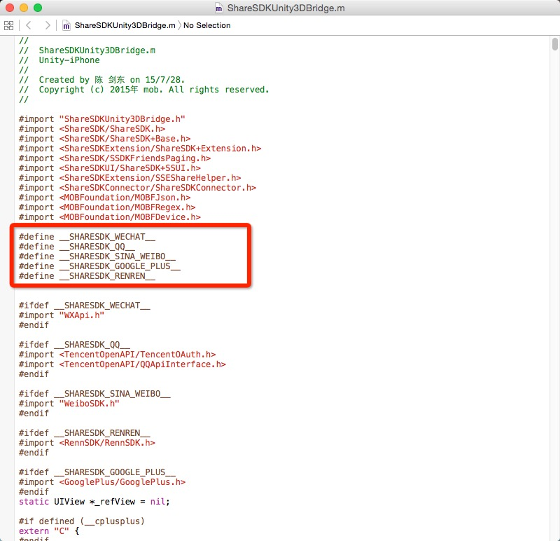
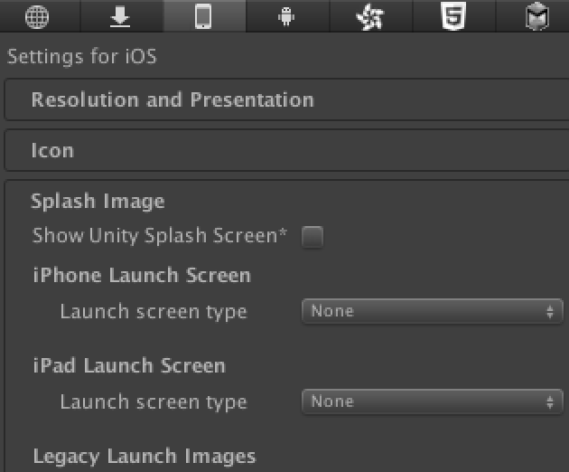
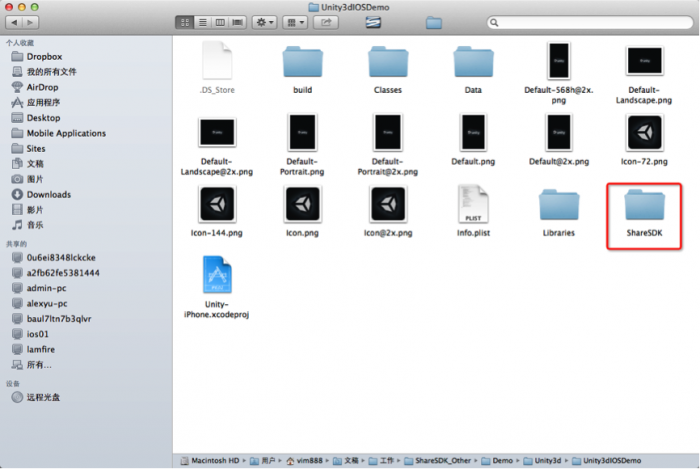
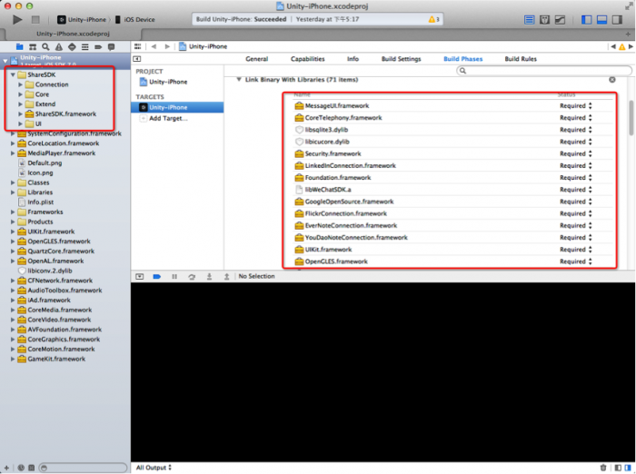
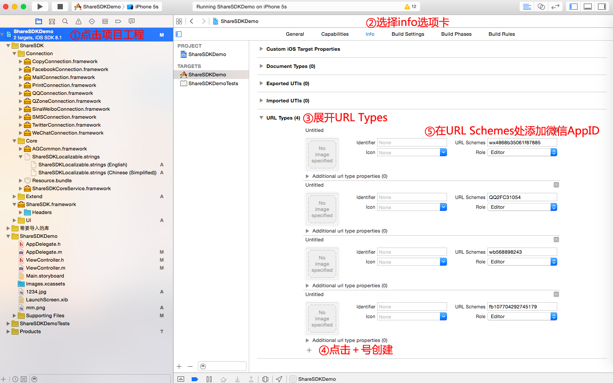

# AR Project  Compile iOS项目说明

## 开发工具
* Unity3D 5.2.1f1
* Xcode 7.0

## 使用SDK
* Vuforia 4.2.3
* iOS9
 
## 第三方依赖包
* ShareSDK iOS Unity依赖包
* ShareSDK Xcode依赖包  

ShareSDK下载[点这里](http://pan.baidu.com/s/1hqm60Os).

##  Unity3D 工程集成设置
> 官方集成帮助文档[点击这里](http://wiki.mob.com/Unity3D%E5%BF%AB%E9%80%9F%E9%9B%86%E6%88%90%E6%8C%87%E5%8D%97/).   

### 特别说明
修改ShareSDKUnity3DBridge.m文件

对于需要使用SSO（QQ空间、人人网）或者部分需要客户端分享的平台（包括：微信、Google＋、QQ）。请确认相对应的宏是否定义，如集成微信，则开启__SHARESDK_WECHAT__。其他平台同理，如下图： 


## Unity3D设置

工程和ShareSDK集成后，配置如下然后导出。

### Vuforia PlaySetting 设置

#### 启动图配置 
 


#### Vuforia基本配置 

  

然后导出iOS项目文件夹即可。   

导出后打开Xcode工程，继续做iOS9适配.

## iOS9适配设置
### Bitcode设置     
 "Build Settings ->Enable Bitcode" "选项中看到这个设置,关闭它
 
### ATS设置
在Info.plist中添加NSAppTransportSecurity类型Dictionary，然后在NSAppTransportSecurity下添加NSAllowsArbitraryLoads类型Boolean,值设为YES。

### Scheme白名单设置
> 无法判断手机是否安装微信等  
canOpenURL: failed for URL: "weixin://app/wxdaae92a9cfe5d54c/" - error: "This app is not allowed to query for scheme weixin"  

受此影响，当你的应用在iOS 9中需要使用微信SDK的相关能力（分享、收藏、支付、登录等）时，需要在“Info.plist”里增加如下代码：

```
<key>LSApplicationQueriesSchemes</key>
<array>
    <string>mqqOpensdkSSoLogin</string>
    <string>mqzone</string>
    <string>sinaweibo</string>
    <string>alipayauth</string>
    <string>alipay</string>
    <string>safepay</string>
    <string>mqq</string>
    <string>mqqapi</string>
    <string>mqqopensdkapiV3</string>
    <string>mqqopensdkapiV2</string>
    <string>mqqapiwallet</string>
    <string>mqqwpa</string>
    <string>mqqbrowser</string>
    <string>wtloginmqq2</string>
    <string>weixin</string>
    <string>wechat</string>
</array>
```

### 移除添加libiPhone-lib.a
另外需要特别说明的是需要在Build Phases移除libiPhone-lib.a库并重新引用，否则会编译出错。此库就在Unity3D导出的iOS工程libraries目录下。

### ShareSDK iOS设置

#### 导入ShareSDK文件夹

将ShareSDK目录拷贝到导出的XCode项目中。如图：

  

#### 添加依赖库  
> [官方视频](http://v.youku.com/v_show/id_XODA5NTMxOTc2.html)    [官方说明](http://wiki.mob.com/%E5%BF%AB%E9%80%9F%E9%9B%86%E6%88%90%E6%8C%87%E5%8D%97/)

将ShareSDK导入工程中，并添加相应的依赖库。执行完成后，如下图：



**必须添加的依赖库如下**：

*SystemConfiguration.framework*   
*QuartzCore.framework*   
*Security.framework*    
*CoreText.framework*   

CoreTelephony.framework  
libicucore.dylib  
libz.1.2.5.dylib   
JavaScriptCore.framework  
libstdc++.dylib  

以下依赖库根据社交平台添加  

1.新浪微博SDK依赖库 （从v2.10.5开始）  

 ImageIO.framework  
AdSupport.framework  
腾讯微博SDK依赖库  

Social.framework  
Accounts.framework  
短信和邮件分享必要  

MessageUI.framework  
2.QQ好友和QQ空间SSO必要（新注册腾讯开放平台帐号只支持SSO授权，只是老开发者才可以使用网页授权）  

libsqlite3.dylib  
3.微信分享必要（从2.11.2开始）  

libsqlite3.dylib  
4.Google+ 分享必要  

CoreMotion.framework  
CoreLocation.framework  
MediaPlayer.framework  
AssetsLibrary.framework  
AddressBook.framework 


#### 修改AppController文件

打开AppController.mm文件，添加ShareSDK.h头文件：
```#import <ShareSDK/ShareSDK.h>```   

新增handleOpenURL的处理方法，代码如下：

```
- (BOOL)application:(UIApplication *)application handleOpenURL:(NSURL *)url
{
return [ShareSDK handleOpenURL:url wxDelegate:nil];
}   
 
- (BOOL)application:(UIApplication *)application openURL:(NSURL *)url sourceApplication:(NSString *)sourceApplication annotation:(id)annotation
{
return [ShareSDK handleOpenURL:url sourceApplication:sourceApplication annotation:annotation wxDelegate:nil];
}

```

#### 添加URL Scheme

> 官方文档[点击这里](http://wiki.mob.com/%E5%BF%AB%E9%80%9F%E9%9B%86%E6%88%90%E6%8C%87%E5%8D%97/)

对于需要客户端分享平台和SSO授权平台，需要添加URL Scheme。如图：



#### 其它问题

一些问题会导致app提交store失败，调整如下：

1. 搜索工程里与info.plist同名的文件并改名。
2. 搜索工程info.plist外的其它plist文件,如果有Bundle identifier属性则删除。

最后签名ipa导出即可.

====

> Written By Leon. mail:skyf@sky.org


